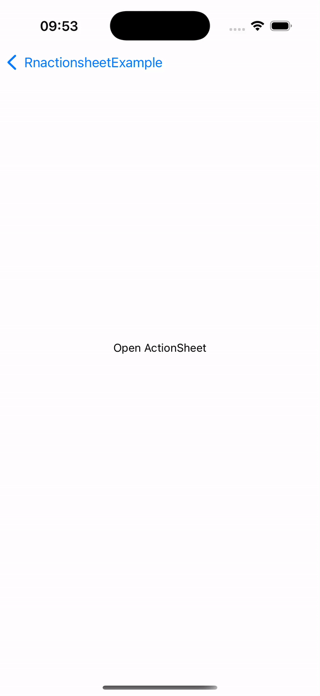

# React Native Platform Bottom Sheet

[](https://badge.fury.io/js/react-native-platform-bottomsheet)
[](https://www.android.com)
[](https://developer.apple.com/ios)

A cross-platform bottom sheet component for React Native that provides a native Material Design bottom sheet on Android and uses the native ActionSheet on iOS.

| Android Demo                     | iOS Demo                 |
| -------------------------------- | ------------------------ |
|  |  |

## Features

- 🎯 Consistent API across platforms
- 📱 Native Material Design bottom sheet on Android
- 🍎 Native ActionSheet on iOS
- 💪 Written in TypeScript
- ⚡ Lightweight with zero dependencies
- 🎨 Customizable styling options
- 🌙 Dark mode support (iOS)

## Installation

```bash
# Using npm
npm install @miinos/rnactionsheet

# Using yarn
yarn add @miinos/rnactionsheet
```

## Usage

```typescript
import RNActionSheet from '@miinos/rnactionsheet';

// Basic usage
const handlePress = () => {
  const selectedIndex = RNActionSheet.showActionSheetWithOptions(
    {
      options: ['Take Photo', 'Choose from Library', 'Cancel'],
      cancelButtonIndex: 2,
      title: 'Select Photo',
      message: 'Choose a method to add your photo',
    },
    (index) => {
      switch (selectedIndex) {
        case 0:
          // Handle take photo
          break;
        case 1:
          // Handle choose from library
          break;
      }
    }
  );
};

// With destructive option
const handleDelete = () => {
  const selectedIndex = RNActionSheet.showActionSheetWithOptions(
    {
      options: ['Delete', 'Cancel'],
      cancelButtonIndex: 1,
      destructiveButtonIndex: 0,
      title: 'Delete Item',
      message: 'Are you sure you want to delete this item?',
    },
    (index) => {
      if (selectedIndex === 0) {
        // Handle delete
      }
    }
  );
};
```

## API Reference

### showActionSheetWithOptions(options, callback)

Returns a Promise that resolves with the selected index.

#### Options

| Property               | Type     | Description                                | Platform |
| ---------------------- | -------- | ------------------------------------------ | -------- |
| options                | string[] | Array of option titles                     | Both     |
| cancelButtonIndex      | number   | Index of cancel button                     | Both     |
| destructiveButtonIndex | number   | Index of destructive button (shown in red) | Both     |
| title                  | string   | Title text shown above options             | Both     |
| message                | string   | Message text shown below title             | Both     |
| tintColor              | string   | Tint color for buttons (iOS only)          | iOS      |
| dark                   | boolean  | Enable dark mode (iOS only)                | iOS      |

## Examples

### Share Menu

```typescript
const shareOptions = {
  options: [
    'Share via Email',
    'Share on Twitter',
    'Share on Facebook',
    'Copy Link',
    'Cancel',
  ],
  cancelButtonIndex: 4,
  title: 'Share',
  message: 'Choose how you want to share this content',
};

RNActionSheet.showActionSheetWithOptions(shareOptions, (index) => {
  console.log(index);
});
```

## Platform Differences

| Feature                   | Android                               | iOS                            |
| ------------------------- | ------------------------------------- | ------------------------------ |
| Animation                 | Material Design bottom sheet slide-up | Native ActionSheet slide-up    |
| Styling                   | Material Design guidelines            | Native iOS appearance          |
| Dark Mode                 | System default                        | Configurable via `dark` option |
| Dismiss on backdrop press | Yes                                   | N/A                            |

## Contributing

See the [contributing guide](CONTRIBUTING.md) to learn how to contribute to the repository and the development workflow.

## Troubleshooting

## Author

Amine SOUAIAIA

- Twitter: [@SoMiinO](https://twitter.com/SoMiinO)
- GitHub: [@miinos](https://github.com/miinos)
- LinkedIn : [@AmineSOUAIAIA](https://www.linkedin.com/in/amine-souaiaia/)

---

Made with [create-react-native-library](https://github.com/callstack/react-native-builder-bob)
