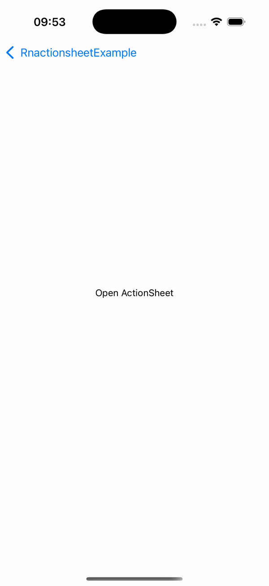

# React Native Action Sheet (@miinos/rnactionsheet)

[](https://badge.fury.io/js/@miinos%2Frnactionsheet)
[](https://www.android.com)
[](https://developer.apple.com/ios)
[](LICENSE)

A cross-platform native Action Sheet component for React Native that provides a native Material Design bottom sheet on Android and uses the native `ActionSheetIOS` on iOS.

| Android Demo                     | iOS Demo                 |
| -------------------------------- | ------------------------ |
|  |  |

## Features

- 🎯 Consistent API across platforms
- ⚡ **Promise-based API** (`showActionSheetWithOptionsAsync`) & callback support
- 📱 Native Material Design bottom sheet on Android (with ripple feedback & scrolling)
- 🍎 Native `ActionSheetIOS` on iOS
- 🌙 **Native Dark Mode** support on both Android and iOS
- 💪 Fully written in TypeScript with strict typing
- 🪶 Lightweight with zero external JavaScript dependencies

## Installation

```bash
# Using npm
npm install @miinos/rnactionsheet

# Using yarn
yarn add @miinos/rnactionsheet
```

## Usage

### 1. Modern Async / Await (Recommended)

```typescript
import { showActionSheetWithOptionsAsync } from '@miinos/rnactionsheet';

const handlePress = async () => {
  const selectedIndex = await showActionSheetWithOptionsAsync({
    title: 'Select Photo',
    message: 'Choose a method to add your photo',
    options: ['Take Photo', 'Choose from Library', 'Cancel'],
    cancelButtonIndex: 2,
    tintColor: '#007AFF',
  });

  switch (selectedIndex) {
    case 0:
      // Handle take photo
      break;
    case 1:
      // Handle choose from library
      break;
    case 2:
      // Cancelled
      break;
  }
};
```

### 2. Traditional Callback

```typescript
import RNActionSheet from '@miinos/rnactionsheet';

const handleDelete = () => {
  RNActionSheet.showActionSheetWithOptions(
    {
      title: 'Delete Item',
      message: 'Are you sure you want to delete this item?',
      options: ['Delete', 'Cancel'],
      destructiveButtonIndex: 0,
      cancelButtonIndex: 1,
    },
    (selectedIndex) => {
      if (selectedIndex === 0) {
        // Handle delete
      }
    }
  );
};
```

## API Reference

### `showActionSheetWithOptionsAsync(options): Promise<number>`

Displays the action sheet and resolves with the index of the selected option (or `cancelButtonIndex` if dismissed).

### `showActionSheetWithOptions(options, callback): void`

Displays the action sheet and invokes the callback with the index of the selected option.

#### `ActionSheetOptions`

| Property                 | Type                 | Description                                                        | Platform |
| ------------------------ | -------------------- | ------------------------------------------------------------------ | -------- |
| `options`                | `string[]`           | Array of option titles (required)                                  | Both     |
| `cancelButtonIndex`      | `number`             | Index of cancel button                                             | Both     |
| `destructiveButtonIndex` | `number \| number[]` | Index (or indices) of destructive buttons (displayed in red)      | Both     |
| `title`                  | `string`             | Title text shown above options                                     | Both     |
| `message`                | `string`             | Message text shown below title                                     | Both     |
| `tintColor`              | `string`             | Color applied to non-destructive option titles                     | Both     |
| `userInterfaceStyle`     | `'light' \| 'dark'`  | Interface style override for iOS (`ActionSheetIOS`)               | iOS      |
| `cancelButtonTintColor`  | `string`             | Specific tint color for the cancel button                          | iOS      |
| `disabledButtonIndices`  | `number[]`           | Indices of buttons that should be disabled                         | iOS      |
| `anchor`                 | `number`             | Node to anchor the sheet to (iPad popover)                         | iOS      |

## Platform Differences

| Feature                   | Android                                 | iOS                            |
| ------------------------- | --------------------------------------- | ------------------------------ |
| Design & Animation        | Material Design Bottom Sheet slide-up   | Native iOS ActionSheet         |
| Dark Mode                 | Automatically adapts to system theme    | Adapts to system or option     |
| Touch feedback            | Material ripple effect                  | Native iOS highlight           |
| Dismiss on backdrop / back| Calls callback with `cancelButtonIndex` | Calls callback with `cancelButtonIndex` |

## Contributing

See the [contributing guide](CONTRIBUTING.md) to learn how to contribute to the repository and the development workflow.

## Author

Amine SOUAIAIA

- Twitter: [@SoMiinO](https://twitter.com/SoMiinO)
- GitHub: [@miinos](https://github.com/miinos)
- LinkedIn: [@AmineSOUAIAIA](https://www.linkedin.com/in/amine-souaiaia/)

---

Made with [create-react-native-library](https://github.com/callstack/react-native-builder-bob)
